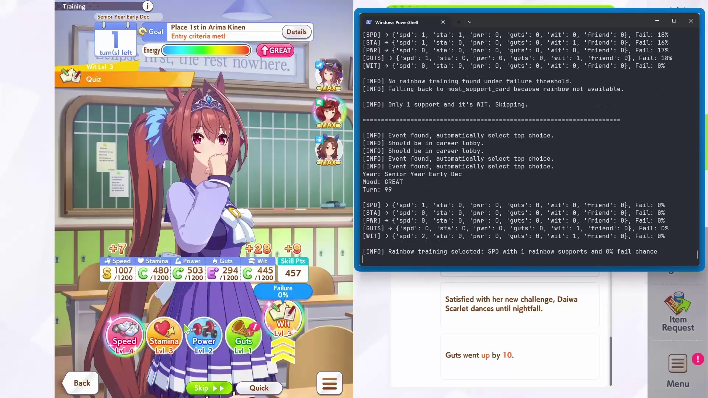

# Umamusume Auto Training Bot
<a href="http://discord.gg/PhVmBtfsKp" target="_blank"></a>

<a href="https://www.buymeacoffee.com/kisegami" target="_blank"></a>
 

Like the title says, this is a simple auto training for Umamusume.

This project is inspired by [samsulpanjul/umamusume-auto-train](https://github.com/samsulpanjul/umamusume-auto-train)

[Demo video](https://youtu.be/CXSYVD-iMJk)



## Features

- Automatically trains Uma with stat prioritization
- Keeps racing until fan count meets the goal, and always picks races with matching aptitude
- Checks mood and handles debuffs automatically
- Rest and recreation management
- Prioritizes G1 races if available for fan farming
- Skill point check for manually skill purchasing
- Stat caps to prevent overtraining specific stats
- Improved training logic with better support card handling
- Minimum support card requirements for training (Read Logic)
- **Intelligent Event Choice Selection**: Automatically analyzes event options and selects the best choice based on configured priorities

## Getting Started

### Requirements

- [Python 3.10+](https://www.python.org/downloads/)
- [Tesseract OCR](https://github.com/tesseract-ocr/tesseract) (for text recognition)

### Setup

#### Clone repository

```
git clone https://github.com/Kisegami/umamusume-auto-train/
```

#### Install dependencies

```
pip install -r requirements.txt
```

#### Install Tesseract OCR

**Windows:**
1. Download and install from [UB-Mannheim's Tesseract installer](https://github.com/UB-Mannheim/tesseract/wiki)
2. Add Tesseract to your system PATH

### BEFORE YOU START

Make sure these conditions are met:

- Screen resolution must be 1920x1080
- The game should be in fullscreen
- Your Uma must have already won the trophy for each race (the bot will skips the race)
- Turn off all confirmation pop-ups in game settings
- The game must be in the career lobby screen (the one with the Tazuna hint icon)

### Configuration

You can edit your configuration in `config.json`

```json
{
  "priority_stat": ["spd", "sta", "wit", "pwr", "guts"],
  "minimum_mood": "GREAT",
  "maximum_failure": 10,
  "prioritize_g1_race": true,
  "skill_point_cap": 400,
  "enable_skill_point_check": true,
  "min_support": 0,
  "do_race_when_bad_training": true,
  "stat_caps": {
    "spd": 1100,
    "sta": 1100,
    "pwr": 600,
    "guts": 600,
    "wit": 600
  }
}
```

#### Configuration Options

`priority_stat` (array of strings)
- Determines the training stat priority. The bot will focus on these stats in the given order of importance.
- Accepted values: `"spd"`, `"sta"`, `"pwr"`, `"guts"`, `"wit"`

`minimum_mood` (string)
- The lowest acceptable mood the bot will tolerate when deciding to train.
- Accepted values (case-sensitive): `"GREAT"`, `"GOOD"`, `"NORMAL"`, `"BAD"`, `"AWFUL"`
- **Example**: If set to `"NORMAL"`, the bot will train as long as the mood is `"NORMAL"` or better. If the mood drops below that, it'll go for recreation instead.

`maximum_failure` (integer)
- Sets the maximum acceptable failure chance (in percent) before skipping a training option.
- Example: 10 means the bot will avoid training with more than 10% failure risk.

`prioritize_g1_race` (boolean)
- If `true`, the bot will prioritize G1 races except during July and August (summer).
- Useful for fan farming.

`skill_point_cap` (integer) - 
- Maximum skill points before the bot prompts you to spend them.
- The bot will pause on race days and show a prompt if skill points exceed this cap.

`enable_skill_point_check` (boolean) - 
- Enables/disables the skill point cap checking feature.

`min_support` (integer) - 
- Minimum number of support cards required for training (default: 0).
- If no training meet the requirement, the bot will do race instead.
- WIT training requires at least 2 support cards regardless of this setting.
- If you want to turn this off, set it to 0

`do_race_when_bad_training` (boolean) - 
- If `true`, the bot will prioritize racing when no training meets the requirements (insufficient support cards, high failure rates, etc.).
- If `false`, the bot will skip support card requirements and train regardless of `min_support` setting (as long as failure rates are acceptable).
- Default: `true`

`stat_caps` (object) - 
- Maximum values for each stat. The bot will skip training stats that have reached their cap.
- Prevents overtraining and allows focusing on other stats.

Make sure the values match exactly as expected, typos might cause errors.

### Event Choice Configuration

The bot now includes intelligent event choice selection. You can configure which choices are considered "good" or "bad" in `event_priority.json`:

```json
{
  "Good_choices": [
    "Charming",
    "Fast Learner", 
    "Hot Topic",
    "Practice Perfect",
    "Energy +",
    "hint +",
    "Speed +",
    "Stamina +",
    "Yayoi Akikawa bond +",
    "Power +",
    "Wisdom +",
    "Skill points +",
    "Mood +",
    "bond +",
    "stat +",
    "stats +",
    "Guts +",
    "Japanese Oaks"
  ],
  "Bad_choices": [
    "Practice Poor",
    "Slacker",
    "Slow Metabolism", 
    "Mood -",
    "Gatekept"
  ]
}
```

#### Customizing Event Priorities

If you want to customize the event priorities beyond the default configuration, you can reference `all_unique_event_outcomes.json` which contains all possible event outcomes in the game until 08/2025. This file serves as a comprehensive reference for:

- **All possible stat gains** (Speed +10, Stamina +15, etc.)
- **All skill hints** (various skill names with hint bonuses)
- **All support card bond changes** (character names with bond +5/-5)
- **All conditions** (Charming, Hot Topic, Practice Perfect, etc.)
- **All energy changes** (Energy +10, Energy -15, etc.)
- **All mood changes** (Mood +1, Mood -1, etc.)

Use this file to discover new event outcomes you might want to add to your `Good_choices` or `Bad_choices` arrays in `event_priority.json`. For example, if you find a specific skill hint or support card bond change you want to prioritize, you can copy the exact text from `all_unique_event_outcomes.json` and add it to your configuration.

#### Event Choice Selection Logic

The bot automatically selects the best event choice based on your configured priorities:

1. **Priority Analysis**: Chooses options with the highest priority good choices first
2. **Tie-Breaking**: When multiple options have the same good choice:
   - Prefers options with fewer bad choices
   - If still tied, prefers options with more good choices
   - If still tied, defaults to the top choice
3. **Fallback**: For unknown events or analysis failures, defaults to the first choice

#### Event Priority Configuration

`Good_choices` (array of strings)
- List of positive effects that should be prioritized
- The bot will prefer choices containing these terms
- Order matters: earlier items have higher priority

`Bad_choices` (array of strings)
- List of negative effects to avoid
- The bot will prefer choices with fewer of these effects
- Used for tie-breaking when multiple options have the same good choices

### Start

```
python main.py
```

To stop the bot, just press `Ctrl + C` in your terminal, or move your mouse to the top-left corner of the screen.

### Training Logic

The bot uses an improved training logic system:

1. **Junior Year**: Prioritizes training in areas with the most support cards to quickly unlock rainbow training.
2. **Senior/Classic Year**: Prioritizes rainbow training (training with support cards of the same type).
3. **Stat Caps**: Automatically skips training stats that have reached their configured caps.
4. **Support Requirements**: Ensures minimum support card requirements are met before training. If not enough support cards, do race instead.
5. **Fallback Logic**: If rainbow training isn't available, falls back to most support card logic.
6. **Rest Logic**: If energy is too low (every training have high failure rate) => Rest

#### Race Prioritization

When `prioritize_g1_race` is enabled:
- The bot will prioritize racing over training when G1 races are available
- Automatically skips July and August (summer break) for racing
- Checks skill points before race days and prompts if they exceed the cap

### Known Issues

- Some Uma that has special event/target goals (like Restricted Train Goldship or 2 G1 Race Oguri Cap) may not working. So please avoid using Goldship for training right now to keep your 12 million yen safe. For Oguri Cap, you can turn on Prioritize G1 race
- Tesseract OCR might misread failure chance (e.g., reads 33% as 3%) and proceeds with training anyway.
- Sometimes it misdetects debuffs and clicks the infirmary unnecessarily (not a big deal).
- If you bring a friend support card (like Tazuna/Aoi Kiryuin) and do recreation, the bot can't decide whether to date with the friend support card or the Uma.
- The bot will skip "3 consecutive races warning" prompt for now
- The bot stuck when "Crietia not meet" prompt appear

### TODO

- Add Race Stragety option (right now the only option is manually changing it)
- Do race that doesn't have trophy yet
- Auto-purchase skills (Partially implemented with skill point management)
- Automate Claw Machine event
- Improve Tesseract OCR accuracy for failure chance detection
- Add consecutive races limit
- Add auto retry for failed races
- Add fans tracking/goal for Senior year (Valentine day, Fan Fest and Holiday Season)
- Add option to do race in Summer (July - August)
- ~Add better event options handling~ (✅ **COMPLETED** - Intelligent event choice selection implemented)


### Contribute

If you run into any issues or something doesn't work as expected, feel free to open an issue.
Contributions are also very welcome, I would truly appreciate any support to help improve this project further.
